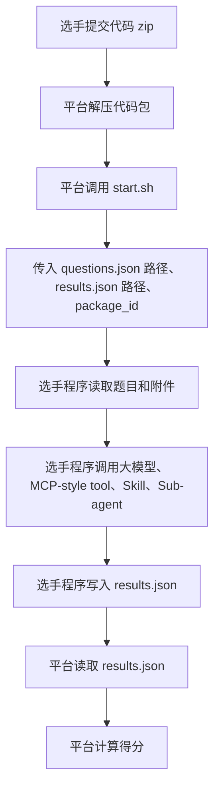

**前言**
本次软件大赛个人赛聚焦 Agent 原生开发能力，综合考察 MCP 工具调用、Skill 能力扩展与 SubAgent 任务协同。
我们已提供基础 Agent Demo，尽可能降低工程与环境门槛，让参赛者专注于 Agent 功能实现。
希望大家通过本次比赛，深入体验 Skill、MCP、SubAgent 等多套能力在真实任务中的组合应用，综合考察 Agent 的任务理解、工具调用、上下文管理、Token 使用效率及泛化能力，端到端完成任务闭环。

# 一、关键技术介绍

## 1.1 MCP

MCP 是一种面向 Agent 的工具接入协议，通过标准化的工具发现、参数描述和调用流程，让大模型能够安全、稳定地访问外部系统、数据和服务，从而突破纯文本推理的能力边界，完成查询、计算、操作、验证等真实任务。


## 1.2 SKILL

Skill 是一种面向 Agent 的可复用能力扩展机制，通过将任务说明、操作脚本和参考资料封装成独立“技能包”，让 Agent 在需要时按需加载并执行特定领域任务，从而实现能力扩展、上下文瘦身和任务解耦。


## 1.3 SubAgent

SubAgent 是一种面向复杂任务的多智能体协同机制，通过将任务拆解为多个子任务，并分配给具备不同职责的子智能体独立处理，再由主 Agent 汇总结果、统一决策，从而提升复杂场景下的执行效率、上下文管理能力和任务完成质量。


# 二、大模型接口资源

# 大模型接口

本次比赛统一提供 Qwen3.5 模型，比赛用例覆盖文本、图像等多模态场景，模型具备**多模态理解与处理能力**。

多模态使用方式：图片转base64编码后传入模型即可

## 2.1、接口说明

接口兼容 OpenAI 格式。

API 接口可能会存在不稳定的情况，选手参考 demo 实现**重试逻辑**和**异常处理逻辑**，避免解答过程中报错（建议可选）。

### 请求地址

```http
POST http://127.0.0.1：8088
```

### Header

| Header | 说明 |
|--------|------|
| `Content-Type` | `application/json` |
| `packageId` | 平台会根据 `start.sh` 动态传入，用于统计 token 消耗，本地调测时不关注 |


### Body 示例

```json
{
  "model": "fuyao-Qwen3.5",
  "temperature": 0.2,
  "stream": false,
  "chat_template_kwargs": {
    "enable_thinking": true
  },
  "max_tokens": 1024,
  "messages": [
    {
      "role": "system",
      "content": "你是 skill 蒸馏攻防 Agent 大赛的参赛 Agent。\n\n你需要解决赛方给出的题目。可用 MCP-style tools、skills 和 sub-agents 来自当前参赛 solution 的自动发现结果。\n题目本身不会指定你应该使用哪个 MCP-style tool、skill 或 sub-agent；是否使用、使用哪个、如何编排，都由你自己决定。\n文件内容不会自动进入上下文；需要读取题目声明的文件或目录内文件时，调用 text_read_file。\n如果需要使用某个 skill，先调用 skill_load 读取完整 SKILL.md，再按其中说明决定是否 skill_read_resource 或 skill_run。\n如果需要复核，可以调用 agent_delegate。\n\n最终只输出题目要求的答案正文。不要输出思考过程、markdown、代码块、<think> 标签、结果对象或额外元数据字段。"
    },
    {
      "role": "user",
      "content": "{\n  \"question\": {\n    \"id\": \"mock_file_001\",\n    \"question\": \"请调用 text_read_file 读取 files/mock_profile.txt。文件内容就是最终答案，只原样回答文件内容。\",\n    \"files\": [\"files/mock_profile.txt\"]\n  },\n  \"files\": [\"files/mock_profile.txt\"],\n  \"available_tools\": [\"text_read_file\", \"skill_load\", \"skill_read_resource\", \"skill_run\", \"agent_delegate\", \"mock_order_lookup\", \"mock_policy_check\"],\n  \"available_skills\": [\"mock_summary_skill\"],\n  \"available_sub_agents\": [\"mock_review_agent\"],\n  \"tool_usage\": \"Call tools only when useful. Use text_read_file to read declared files; use skill_load before skill_run; use agent_delegate for sub-agents.\",\n  \"final_output\": \"Return only the final answer text.\"\n}"
    }
  ]
}
```

| 字段 | 说明 |
|------|------|
| `model` | 固定为 `fuyao-Qwen3.5` |
| `chat_template_kwargs` | 可选，"enable_thinking" 默认为true，为true时打开模型推理，反之则关闭模型推理 |
| `messages` | 对话消息列表 |
| `stream` | false 表示非流式、true 表示流式 |

---

## 2.2、postman调用示例

### 配置要点

| 项 | 值 |
|----|-----|
| Method | `POST` |
| URL | `http://127.0.0.1：8088` |
| Header `Content-Type` | `application/json` |
| Header `packageId` | （本地调测不需要传入；正式环境由 `start.sh` 传入） |
| Body | raw JSON，内容与 [2.1](#21接口说明) Body 示例一致 |

---

## 2.3、OpenAI格式python调用示例

```python
import json
import urllib.request

MODEL_BASE_URL = "http://127.0.0.1：8088"
MODEL_API_KEY = "sk-AgentCompetition-AgentCompetition"
MODEL_NAME = "fuyao-Qwen3.5"

PACKAGE_ID = ""  # 可选；判题器会传入来标识，用户调测无需关注，但需要保留

url = MODEL_BASE_URL.rstrip("/") + "/chat/completions"

headers = {
    "Content-Type": "application/json",
    "Authorization": f"Bearer {MODEL_API_KEY}",
}
if PACKAGE_ID:
    headers["package_id"] = PACKAGE_ID

payload = {
    "model": MODEL_NAME,
    "messages": [
        {"role": "user", "content": "请只回答：model gateway ok"}
    ],
    "temperature": 0.2,
    "stream": False,
    "max_tokens": 1024,
}

request = urllib.request.Request(
    url,
    data=json.dumps(payload, ensure_ascii=False).encode("utf-8"),
    headers=headers,
    method="POST",
)

with urllib.request.urlopen(request, timeout=60) as response:
    result = json.loads(response.read().decode("utf-8"))

print(result["choices"][0]["message"]["content"])
```

# 三、输入输出案例和要求

## 3.1、整体流程说明

**选手：**

按照大赛要求和示例编写 Agent 程序，可按需实现或调用 MCP-style tool、Skill、Sub-agent 等能力。选手需要将可执行代码整体打包为 zip 文件并上传到大赛平台，代码包根目录必须包含 `start.sh`。

**平台程序：**

平台自动解压选手提交代码包，并调用代码包中的 `start.sh` 脚本，传入以下三个参数：

1. 问题 JSON 路径
2. 结果 JSON 路径
3. `package_id`

调用格式：

```bash
bash start.sh <questions_json_path> <results_json_path> <package_id>
```

**参赛选手程序：**

程序从问题 JSON 路径读取题目，解析题目描述和附件文件，调用大模型和必要工具进行解答，并将结果写入结果 JSON 路径。

**平台程序：**

平台从结果 JSON 路径读取选手答案，根据题目标准答案和评分规则计算得分。



## 3.2、平台输入问题 JSON 格式

文件名示例：

```text
questions.json
```

格式示例：

```json
[
    {
        "id": "1_1",
        "title": "监控截图告警信息提取",
        "description": "附件图片为一张系统监控页面截图，页面中展示了多个服务或设备的运行状态。\n\n请识别截图中所有处于告警或异常状态的服务/设备名称，并按截图中从上到下、从左到右的顺序返回，名称之间使用英文逗号分隔。\n\n【返回格式示例】订单服务,支付网关,缓存节点03",
        "explanation": "1、截图布局变种：可能为表格、卡片、看板、大屏等不同展示形式\n2、状态表达变种：可能使用异常、告警、故障、离线、失败、Error、Failed 等不同状态描述\n3、视觉标识变种：异常状态可能通过文字、颜色、图标、标签等方式体现\n4、对象名称变种：服务/设备名称可能为中文、英文、编号或中英文混合\n5、干扰信息变种：截图中可能包含时间、指标、数量、趋势图等无关信息",
        "files": [
            "monitor_alert_screenshot.png"
        ],
        "level": 1,
        "tools": [],
        "skills": [],
        "sub_agents": []
    }
]
```

字段解释：

| 字段 | 是否必选 | 解释 |
|---|---|---|
| `id` | 必选 | 题目编号，选手输出结果时必须原样返回 |
| `title` | 可选 | 题目标题，用于辅助理解题目 |
| `description` | 必选 | 题目描述，包含具体任务要求和返回格式要求 |
| `explanation` | 可选 | 题目在目标运行环境里涉及的关键变化点说明 |
| `files` | 可选 | 题目依赖的附件列表，路径相对 `questions.json` 所在目录；可列文件，也可列文件夹 |
| `level` | 必选 | 题目难度或分值等级，不同级别分数不同 |
| `tools` | 可选 | 题目相关工具提示，程序可参考，也可以自行编排 |
| `skills` | 可选 | 题目相关 Skill 提示，程序可参考，也可以自行编排 |
| `sub_agents` | 可选 | 题目相关 Sub-agent 提示，程序可参考，也可以自行编排 |

说明：

- 附件文件不会自动进入 prompt，选手程序需要按需读取。
- `files` 中的相对路径以 `questions.json` 所在目录为基准。
- 如果 `files` 中列出的是文件夹，则该文件夹下的文件允许被读取。
- 平台传给选手程序的题目 JSON 不包含标准答案。

## 3.3、选手输出答案 JSON 格式

文件名示例：

```text
results.json
```

格式示例：

```json
[
  {
    "id": "1_1",
    "answer": "2026-05-06,2026-05-07"
  },
  {
    "id": "1_2",
    "answer": "2026-05-08,2026-05-11"
  }
]
```

字段解释：

| 字段 | 是否必选 | 解释 |
|---|---|---|
| `id` | 必选 | 必须与输入题目的 `id` 完全一致 |
| `answer` | 必选 | 选手程序输出的最终答案 |

输出要求：

- `results.json` 必须是 JSON 数组。
- 每个结果对象只需要包含 `id` 和 `answer`。
- `answer` 应直接填写最终答案，不需要额外解释、推理过程、Markdown 代码块或其他元数据。
- 判题器只读取 `answer` 字段进行评分。
- 解题时间限制：

单次运行最多不能超过 1 小时。超过时间后程序会被平台强制终止。强烈建议选手程序每完成一道题，就立即刷新写入一次 `results.json`，避免程序中途异常导致已完成答案丢失。

## 3.4、Token 消耗统计实现

平台调用 `start.sh` 时会传入第三个参数 `package_id`：

```bash
bash start.sh <questions_json_path> <results_json_path> <package_id>
```

选手程序在调用大模型接口时，需要将该值作为 HTTP Header 透传给模型网关：

```text
package_id: <package_id>
```

后台会根据 `package_id` 自动统计本次提交代码包的大模型调用量和 token 消耗。

要求：

- 不要丢弃 `package_id`。
- 不要把 `package_id` 写死在代码中。
- 程序应从 `start.sh` 接收到的第三个参数中读取 `package_id`，并在调用模型时透传给模型服务。

# 四、目标环境说明

判题器在Linux环境上判题，参赛demo支持本地windows和Linux环境运行，运行结果没有区分。

选手需要确保`本地调测环境`与`目标运行环境`的**语言/依赖版本**保持一致，在本地机器上充分验证代码运行无误后再打包上传平台，避免出现程序无法启动、依赖缺失或运行异常等问题。

目标机器已预装 Python、Java、Node.js、Go 运行/编译环境，并支持 `bash`、UTF-8 编码环境。四个语言 demo 的统一启动方式为：

```bash
bash start.sh <question_path> <result_path>
```

## 4.1、Python 环境

Python demo 使用 Python 3.9.9 版本。

本次 Python demo 默认不依赖 `mcp`、`fastmcp`、`openai`、`requests` 等第三方包，`requirements.txt` 默认留空。模型网关调用使用 Python 标准库实现。

运行示例：

```bash
bash start.sh source/examples/questions.json source/outputs/result.json
```

如果选手自行引入第三方 Python 包，需要将依赖写入 `requirements.txt`，并确保本地调测环境与目标运行环境依赖版本一致。

Python demo 运行时会自动切换工作目录到 demo 根目录，不需要手动切到某个 `main_client.py` 路径。

## 4.2、Java 环境

Java demo 需要 JDK 21 版本，目标环境需同时具备 `java` 和 `javac`。

当前Java demo不要求Maven，默认也不联网下载依赖。

运行示例：

```bash
bash start.sh source/examples/questions.json source/outputs/result.json
```

如选手需要使用第三方 Java 依赖，请提前下载对应 jar 包并放入 demo 根目录的 `lib/` 下。`start.sh` 编译和运行时会自动加入 `lib/*`。

## 4.3、JS 环境

JS demo 需要 Node.js 20.18 版本。

当前 demo 默认不依赖 `mcp`、`openai sdk` 等第三方 npm 包，也不会在目标环境执行 `npm install`。`start.sh` 会直接使用 Node.js 运行 `source/main.mjs`。

运行示例：

```bash
bash start.sh source/examples/questions.json source/outputs/result.json
```

如选手自行引入 npm 依赖，需要提前准备好 `node_modules/` 或按平台要求随提交包一起提供，避免目标环境联网安装依赖失败。

## 4.4、Go 环境

Go demo 需要 Go 1.20 版本。

当前 Go demo 使用 `go run` 启动，因此目标环境需要安装 Go SDK，而不是只提供已编译二进制运行环境。

运行示例：

```bash
bash start.sh source/examples/questions.json source/outputs/result.json
```

如选手自行引入第三方 Go 依赖，建议提前整理好 `go.mod`、`go.sum`，并按平台要求准备 `vendor/` 目录。demo 检测到 `vendor/` 后会使用 `-mod=vendor` 运行，便于目标环境离线执行。

# 五、排名规则

1、**重复提交取最新一次分数**
2、首先按照积分排序,积分多者排序靠前;
3、积分相同的情况下,按照答题消耗的Token数排序,Token消耗少者靠前;
4、积分与总Token消耗均相同的情况下，按照提交次数排序，提交次数少者靠前。

# 六、作品目录结构和参数要求

## 6.1、作品目录结构要求

作品必须按照如下结构创建，除start.sh为必须外，其余文件均为可选，并将​**文件夹压缩为ZIP包(不允许为其他格式)上传至对战平台**​：

```

/agents             #压缩包一级目录
├─start.sh           #程序启动脚本(必选）
├─doc                #压缩包二级目录，选手设计文档（可选）
├─source           #压缩包二级目录，选手源代码（可选）
├─.env               #大模型配置文件(必选)

```

ZIP包压缩结构参照下图：


按照上述过程压缩好的程序包在大赛平台上提交代码上传，之后即可排队运行


## 6.2、作品参数要求

`start.sh`有`3`个输入参数，按顺序：`question_path、result_path、package_id`
正式比赛时，输入的参数由竞赛系统给定！请勿在脚本中写死
`start.sh`内容由选手自行实现，demo 提供的`start.sh`默认可直接使用

## 6.3、作品各语言依赖放置格式

选手提交的作品代码包必须可直接运行。平台运行选手代码时，默认不会主动联网下载 Java、JS、Go 的第三方依赖。选手如果使用第三方依赖，需要按照对应语言的目录规范提前放入代码包中。

平台会调用代码包根目录下的 `start.sh`：

```bash
bash start.sh <questions_json_path> <results_json_path> <package_id>
```

各语言依赖放置格式如下。

.env文件中的如下配置在提交时应保持原样，否则会直接判题失败：

```
MODEL_CHAT_COMPLETIONS_URL
MODEL_API_KEY
MODEL_NAME
```

### 6.3.1、Python 依赖

Python 作品目录结构示例：

```text
python_demo/
  requirements.txt
  start.sh
  source/
```

Python 第三方依赖写入：

```text
requirements.txt
```

如果选手需要安装 Python 第三方依赖，可以在 `start.sh` 中解除预留的 venv 和 pip install 注释。例如：

```bash
"$PYTHON_CMD" -m venv .venv
PYTHON_CMD="$(detect_venv_python)" && "$PYTHON_CMD" -m pip install --trusted-host mirrors.tools.huawei.com -i http://mirrors.tools.huawei.com/pypi/simple -r requirements.txt
```

说明：

- 默认情况下，平台不会自动执行 pip install。
- 如需安装依赖，选手应将依赖包名写入 `requirements.txt`。
- 如果 `requirements.txt` 为空，pip install 命令会直接成功，不会安装任何第三方包。

### 6.3.2、Java 依赖

Java 作品目录结构示例：

```text
java_demo/
  lib/
    xxx.jar
  start.sh
  source/
```

Java 第三方依赖 jar 放入：

```text
lib/
```

例如：

```text
java_demo/lib/fastjson.jar
java_demo/lib/commons-lang3.jar
```

平台运行时，`start.sh` 会在编译和运行阶段自动将 `lib/*` 加入 classpath。

说明：

- 选手不需要把依赖打成 fat jar。
- 选手只需要将已下载好的依赖 jar 放入 `lib/` 目录。
- 平台默认不会联网下载 Maven 或 Gradle 依赖。

### 6.3.3、JS 依赖

JS 作品目录结构示例：

```text
js_demo/
  node_modules/
  package.json
  start.sh
  source/
```

JS 第三方依赖放入：

```text
node_modules/
```

平台运行时，Node.js 会从当前项目的 `node_modules/` 目录解析依赖。

说明：

- 平台默认不会执行 `npm install`、`pnpm install` 或 `yarn install`。
- 如果选手使用第三方 npm 包，需要提前将可用的 `node_modules/` 一起放入提交代码包。
- 如果依赖包含 native addon，建议在与平台运行环境一致的 Linux 环境中生成 `node_modules/`，避免系统或架构不兼容。

### 6.3.4、Go 依赖

Go 依赖管理方式与 Java、JS 不同。Go 依赖需要通过 `go.mod` 声明，并通过 `vendor/` 保存离线依赖源码。

Go 作品目录结构示例：

```text
go_demo/
  go.mod
  go.sum
  vendor/
    github.com/
      xxx/
        yyy/
  start.sh
  source/
```

其中：

| 文件或目录 | 说明 |
|---|---|
| `go.mod` | 声明 Go 模块名称、Go 版本和依赖包版本 |
| `go.sum` | 记录依赖包校验信息 |
| `vendor/` | 保存第三方依赖源码，用于离线运行 |

添加 Go 第三方依赖时，通常执行：

```bash
go get github.com/xxx/yyy
go mod tidy
go mod vendor
```

然后将以下内容一起放入提交代码包：

```text
go.mod
go.sum
vendor/
```

平台运行时，`start.sh` 检测到 `vendor/` 后会使用：

```bash
go run -mod=vendor ./source/main.go ...
```

这样 Go 会从本地 `vendor/` 读取依赖，不会联网下载。

说明：

- Go 依赖不能只随意复制源码目录，必须与 `go.mod` 中声明的模块和版本匹配。
- 如果 Go 程序没有外部依赖，保持默认的 `go.mod` 和空 `vendor/` 目录即可。
- 如需完全避免平台编译，也可以自行提供已编译好的可执行文件，但本 demo 默认采用源码运行方式。

# 七、各语言demo示例

[demo 下载](https://onebox.huawei.com/v/d23f0e9ad72c1e58bbd0dffb782bfd02/list)

python demo
js demo
java demo
go demo


# 八、正式比赛题目

正式比赛题目于2026年06月11日早上8:30正式公布
